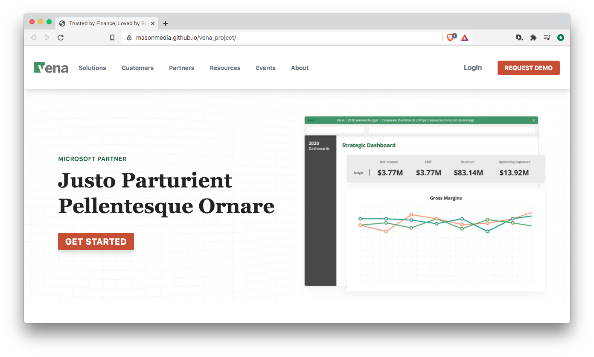

# Vena Solutions Mockup

A responsive mockup for Vena Solutions. This project was a one-page website built to detailed specs based on a Figma multi-section layout including 3 popup contact forms, a carousel, and the exclusive use of Tailwind CSS. The mockup makes use of the AOS library for scroll animations.

## Notes

### Deployment

I deployed the mockup using github pages for fast development and sharing. 

### Carousel 

For the carousel section, the assigned spec was a bit vague: "The first product feature needs to be a carousel image (with 3 product screenshots). The images can be reused". From this description it was a difficult to know exactly what route to take for building this out - especially on mobile. I would not normally use a carousel in a two-column type of layout for mobile - i.e. text on left, carousel on right: the images get detached from the accompanying text, which isn't ideal for UX and ease of use. In my version, I made each of the text paragraphs on the left column highlighted and clickable to make them more clearly connected with the corresponding image slides. I also built a different version for tablet/mobile to keep the copy and images connected.

### Breadcrumbs

While it was specified that breadcrumbs were to be included in the layout, they normally only exist on subpages, not on the homepage.  As such I included a "solutions" page which includes breadcrumbs in the style of Vena's current site.

### CDNs

For speed of development I used the CDN for Tailwind.  As noted in the docs, this is a large file and affects page load time/speed. In a production build I would include hard copies and make use of the Tailwind sass extension files/libraries. 

### SEO, AODA

I included very basic SEO and AODA tags. For production this would be more thoroughly tuned up.

### Optimization + Testing

Load speed was not thoroughly optimized in this mockup, though some basic image optimizing was done to improve image loading.  Moderate cross browser testing was run using current versions of Safari, Chrome, Firefox, and Brave on Mac environment, along with core device/screen testing. 

*Some of the initial graph and browser images used in the mockup were pulled from the vena website in .webp format, which I realized later in testing - does not work in Safari. Thus they were replaced with png format for compatibility.